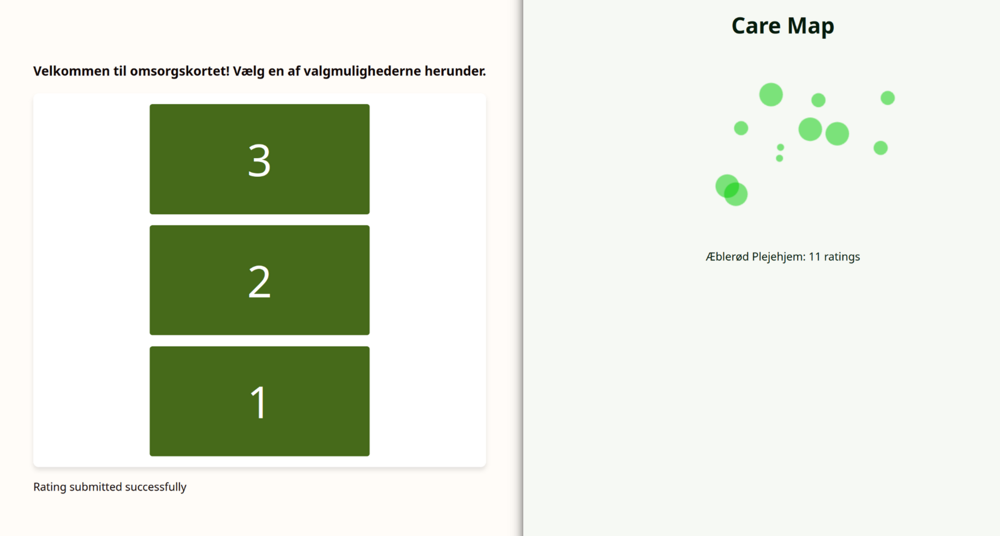
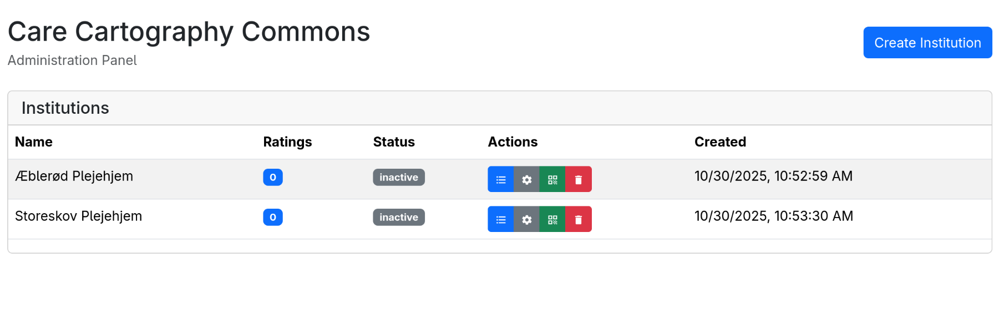

# Care Cartography Commons

Care Cartography Commons is a real-time collaborative mapping platform for mapping care in institutional settings to a generative artwork based on user submitted data.

**Current status:** The project is in active development and not ready for pull requests yet. The project aims to reach version 1.0 in December, 2025.

## Tech stack

- Core dependencies: Python, Node.js, Docker
- Frontend: React, paper.js, Bootstrap
- Backend: FastAPI, PostgreSQL, Uvicorn, SQLAlchemy
- Dev tooling: pnpm, Turborepo

## Functionality

Users scan a QR code and submit data (displayed on the left below). This data then feeds into a generative, visual artwork updated in real time using websockets (displayed on the right below):



Admins can create and manage data collection for institutions:



## Code organization

The code is organized in a monorepo with backend code under `packages/api` and frontend applications under `apps`.

For further details on the code structure, see the [project specification](./docs/spec.md).

In version 1, the goal is to dockerize the whole system for reproducible build environments and easy deployment.

## Installation

To set up a dev environment, first install core dependencies:

- Python
- Node.js
- Docker

Then clone this repo, cd into the project root directory:

```shell
git clone https://github.com/Care-Cartography-Commons/core.git
cd core
```

For managing JS/TS dependencies, we use [pnpm](https://pnpm.io). To install the dependencies, run:

```shell
pnpm install
```

We also need to create a python virtual environment for the backend and install the python dependencies:

```shell
cd packages/api
python -m venv .venv
pip install -e .[]
```

## Running the dev server

To start the development server, run the following command from the project root:

```shell
pnpm dev
```

This uses [Turborebo](https://turborepo.com/) to start both the backend and frontend applications in development mode and will also start a local PostgreSQL docker container. At first run, it may take a few minutes to fetch the docker image and set up the database.

See [package.json](./package.json) for more available commands.

**Beware:** The project is not yet ready for deployment, the above instructions are for development purposes only.

